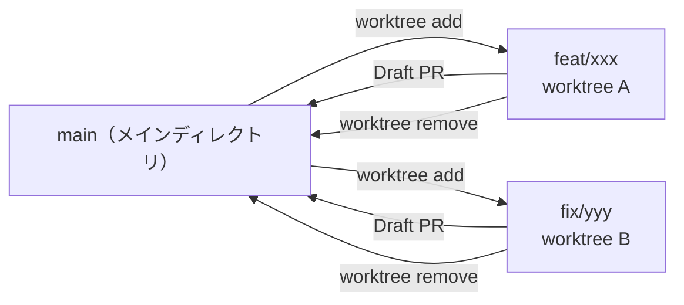

# Git Strategies

## Atomic Commits（意味単位のコミット）

1コミット = 1つの意味のある変更。以下のテストを満たすこと：

- **読める**: diff を見て「何をしたか」が30秒で分かる
- **戻せる**: このコミットだけ revert しても壊れない
- **説明できる**: コミットメッセージが1行で書ける
- **意図がある**: Why（なぜこの変更か）を書く。What だけでは不十分

### コミットメッセージのフォーマット

```
type(scope): what

Why: なぜこの変更が必要か（1-2行）
```

例:

```
feat(git): add pre-commit branch check rule

Why: エージェントが main に直接コミットする習慣を構造的に防止する
```

### やるべき分割

| 状況 | 分割方法 |
| --- | --- |
| 新しいファイル3個+既存修正2個 | ファイル作成 → 既存修正 の2コミット |
| リファクタ + 機能追加 | リファクタ → 機能追加 の2コミット |
| バグ修正 + テスト追加 | 修正 → テスト の2コミット |
| lint 修正が混ざった | lint → 本体 の2コミット |

### やってはいけないこと

- ❌ 「とりあえず全部 add して commit」
- ❌ 1コミットに3つ以上の異なる関心事
- ❌ コミットメッセージに "and" が2回以上出る

## Branch Strategy（ブランチ運用）

### 最重要ルール

**main は受け取るだけ。変更は常に外で始める。**

```
main ← マージだけ。直接コミットしない
 └── feat/xxx ← 機能開発
 └── fix/xxx ← バグ修正
 └── docs/xxx ← ドキュメント
```

### 手順

1. **作業開始 → worktree を作成**: `git worktree add ../{repo}-{branch} -b feat/xxx`
2. **1 worktree = 1 ブランチ = 1 目的**（機能、修正、リファクタ）
3. 完了 → **Draft PR を作成**（マージは人間が判断）
4. レビュー後 → main にマージ + `git worktree remove` + ブランチ削除
5. main に直接コミットする例外は**ない**。typo でもブランチを切る

### Draft PR ルール

- エージェントは **Draft PR のみ** 作成する。Ready にしない
- PR 説明に「何をしたか」「なぜ」「テスト結果」を含める
- マージは**人間が判断**する。エージェントはマージしない

### ブランチを切るタイミング

| 状況 | ブランチ |
| --- | --- |
| 新機能の開発 | `feat/add-xxx` |
| バグ修正 | `fix/resolve-xxx` |
| ドキュメント修正 | `docs/fix-xxx` |
| 実験的な変更 | `experiment/try-xxx` |

### マージ前チェック

- [ ] テスト/lint が通る
- [ ] コミット履歴が意味単位に分割されている
- [ ] 不要なデバッグコードが残っていない

## Pre-commit Check（コミット前に必ず実行）

`git commit` を実行する前に、以下を**毎回**確認する：

1. **worktree 内にいるか？** — `git worktree list` でカレントディレクトリが worktree であることを確認
2. **メインディレクトリにいる → コミットしない**。worktree を作成してから再開
3. **ブランチ名と作業内容が一致しているか？** — `git branch --show-current` で確認

| 作業内容 | 正しいブランチ | 間違い |
| --- | --- | --- |
| 新機能追加 | `feat/add-xxx` | `main`, `fix/xxx` |
| バグ修正 | `fix/resolve-xxx` | `main`, `feat/xxx` |
| ドキュメント更新 | `docs/update-xxx` | `main` |
| リファクタ | `refactor/xxx` | `main` |

**間違った worktree にいる場合**: 正しい worktree のディレクトリに移動する（stash/checkout ではない）

## Commit Timing（いつコミットするか）

以下のタイミングで即コミット：

1. **動作確認が取れた**とき — 壊れない状態を保護する
2. **方向転換する前** — 戻れるセーブポイントを作る
3. **1つの作業単位が完了した**とき — 中途半端にしない

## Git Worktree（デフォルトの作業方法）

すべての作業は **worktree** で行う。メインの作業ディレクトリは常に main を指す。

### 命名規則

`../{repo}-{branch-suffix}` — リポジトリ名 + ブランチのサフィックス

```powershell
# 例: skills-my-util リポジトリで作業する場合
git worktree add ../skills-my-util-feat-skill-update -b feat/skill-update
git worktree add ../skills-my-util-fix-setup-bug -b fix/setup-bug
```

### Worktree ルール

| ルール | 理由 |
| --- | --- |
| 1 worktree = 1 ブランチ = 1 目的 | コンテキスト混在を防ぐ |
| 作業完了後は `git worktree remove` | ゴミを残さない |
| main の worktree は作らない | main は受け取るだけ |
| worktree 内で別ブランチに checkout しない | worktree の意味がなくなる |

### 作業フロー



## Anti-Patterns

- ❌ main に直接コミット（typo でも例外なし）
- ❌ メインディレクトリで `git checkout -b` して作業（worktree を使う）
- ❌ 動作確認前にコミット（壊れた状態を保存しない）
- ❌ 長時間コミットしない（クラッシュ時にすべて失う）
- ❌ WIP コミットを大量に積む（後でまとめることを前提にしない）
- ❌ エージェントが PR をマージする（人間の判断を奪わない）
- ❌ 1つの worktree で複数ブランチを切り替える
- ❌ PR済みブランチを使い回して別の変更を積む
