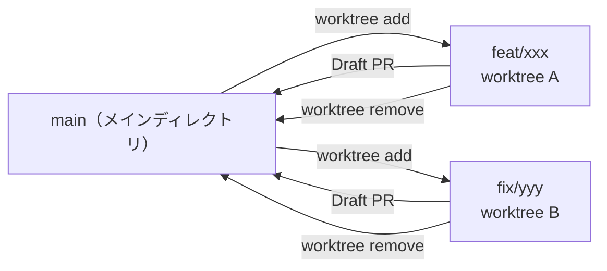

# Git Worktree（デフォルトの作業方法）

すべての作業は **worktree** で行う。メインの作業ディレクトリは常に main を指す。

## 命名規則

`../{repo}-{branch-suffix}` — リポジトリ名 + ブランチのサフィックス

```powershell
# 例: skills-my-util リポジトリで作業する場合
git worktree add ../skills-my-util-feat-skill-update -b feat/skill-update
git worktree add ../skills-my-util-fix-setup-bug -b fix/setup-bug
```

## Worktree ルール

| ルール | 理由 |
| --- | --- |
| 1 worktree = 1 ブランチ = 1 目的 | コンテキスト混在を防ぐ |
| 作業完了後は `git worktree remove` | ゴミを残さない |
| main の worktree は作らない | main は受け取るだけ |
| worktree 内で別ブランチに checkout しない | worktree の意味がなくなる |

## 作業フロー


