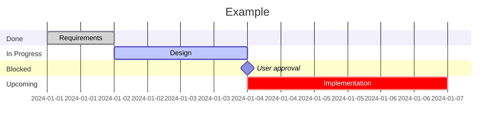

# Task Planning

非自明なタスクには **mermaid Gantt chart** をタスクファイルに含める：

- **Planned**, **active** (`active`), **critical path** (`crit`)
- **Human gates** — `milestone` で人間承認のボトルネックを明示

## Rules

- Gantt chart は**永続ファイル**に書く（`task.md`）— セッション中断に耐える
- セッション開始時に**既存タスクファイルを確認** — あれば前回の状態から再開
- `milestone` には**誰が**ブロックしていて**何を**決める必要があるかを記載
- **各フェーズ完了後**にチャートを更新（開始時だけではない）
