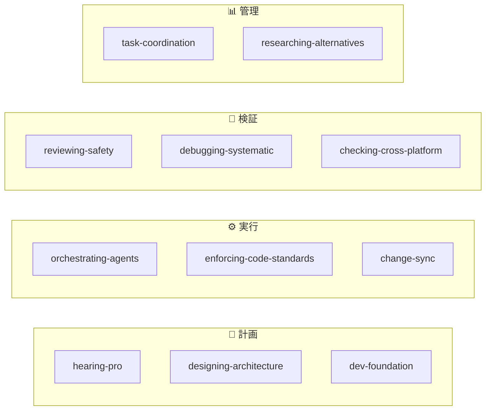
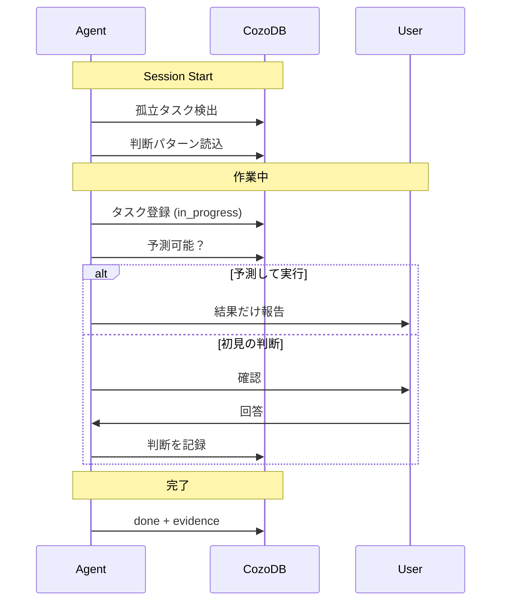

# skills-my-util

AI エージェント用のスキル・ルール・ワークフローを一元管理するモノレポジトリ。

## セッション・ライフサイクル


## Pre-flight でチェックする3つ


## スキル活性化マップ



## CozoDB データフロー



## セットアップ

```powershell
# 全スキルを Antigravity にインストール
.\scripts\setup.ps1 -t antigravity

# ルール/ワークフローを全ワークスペースに配布
.\scripts\sync-env.ps1

# 特定プロジェクトにも配布
.\scripts\sync-env.ps1 -TargetWorkspace "D:\project\my-app"
```

> [!NOTE]
> `setup.ps1` はシンボリックリンクを使用するため、リポジトリ内の編集が即座に反映されます。
> Windows では管理者権限 or 開発者モードが必要です。

### CozoDB 依存（オプション）

タスク状態追跡・判断予測・孤立タスク検出は [MCP CozoDB Server](https://github.com/AtsushiYamashita/mcp-cozodb) + [CozoDB Connector Skill](https://github.com/AtsushiYamashita/skills-cozodb-connector) に依存します。

- **未導入の場合**: `setup.ps1` が自動検出し、CozoDB 関連ルールをスキップします
- **導入したい場合**: 上記2リポをセットアップ後、再度 `setup.ps1` を実行してください
- **CozoDB 無しでも動作**: スキルとルールの基本機能は CozoDB なしで利用可能です

### 対応プラットフォーム

| Target        | Skill Path                                   |
| ------------- | -------------------------------------------- |
| `claude-code` | `~/.claude/skills/<skill-name>/`             |
| `gemini-cli`  | `~/.gemini/skills/<skill-name>/`             |
| `antigravity` | `~/.gemini/antigravity/skills/<skill-name>/` |

## コンポーネント一覧

### Skills（条件付き活性化）

| スキル | 概要 | 起動条件 |
| --- | --- | --- |
| [orchestrating-agents](skills/orchestrating-agents/) | 7フェーズ委任 + Pre-flight Sync | 非自明タスク |
| [hearing-pro](skills/hearing-pro/) | アイデア具体化、既存サービスチェック | 要件不明確 |
| [designing-architecture](skills/designing-architecture/) | ドメイン駆動 + AI-Native リポ構造 | `ARCHITECTURE.md` 未整備 |
| [dev-foundation](skills/dev-foundation/) | Shift-left、CI/CD、依存ラッピング | 基盤未構築 |
| [enforcing-code-standards](skills/enforcing-code-standards/) | コード品質、AI-Native 構造 | コード作成/レビュー |
| [reviewing-safety](skills/reviewing-safety/) | 爆発半径、多層防御、テスト | セキュリティレビュー |
| [researching-alternatives](skills/researching-alternatives/) | 調査比較 + ADR 出力 | 技術選定 |
| [task-coordination](skills/task-coordination/) | GitHub Issues + CozoDB 二層管理 | 複数参画者 |
| [debugging-systematic](skills/debugging-systematic/) | 仮説駆動6ステップ | バグ調査 |
| [checking-cross-platform](skills/checking-cross-platform/) | OS/シェル互換性 | スクリプト/CI |
| [change-sync](skills/change-sync/) | 宣言的ファイル変更伝播 | ファイル同期 |

### Rules（常時適用）

| ルール | 内容 |
| --- | --- |
| [command-execution](/.agent/rules/command-execution.md) | SafeToAutoRun 分類、日本語コマンド提案 |
| [conventions](/.agent/rules/conventions.md) | Conventional Commits、コンテキスト保存 |
| [core-principles](/.agent/rules/core-principles.md) | 4原則（User-Centricity 等） |
| [goal-alignment](/.agent/rules/goal-alignment.md) | Goal/Action 明示、Why 問い返し |
| [reasoning-first](/.agent/rules/reasoning-first.md) | 思考→計画→実行→検証 |
| [task-state](/.agent/rules/task-state.md) | CozoDB タスク追跡 + 判断予測 |
| [task-planning](/.agent/rules/task-planning.md) | Gantt chart、セッション復帰 |
| [self-correction](/.agent/rules/self-correction.md) | エラー報告レベル |

### Workflows（明示的呼び出し）

| ワークフロー | 内容 |
| --- | --- |
| `/session-end` | セッション終了時のコンテキスト永続化 |
| `/new-skill` | 新規スキル作成 |

### CozoDB テーブル（要: [mcp-cozodb](https://github.com/AtsushiYamashita/mcp-cozodb)）

| テーブル | 用途 |
| --- | --- |
| `tasks` | タスク状態管理（evidence 必須 done） |
| `task_transitions` | 遷移の監査証跡 |
| `user_decisions` | ユーザー判断パターン → 予測 |

> [!TIP]
> CozoDB 未導入の場合、これらの機能は無効になります。導入手順:
> 1. [mcp-cozodb](https://github.com/AtsushiYamashita/mcp-cozodb) をセットアップ
> 2. [skills-cozodb-connector](https://github.com/AtsushiYamashita/skills-cozodb-connector) をインストール
> 3. `setup.ps1` を再実行

## ディレクトリ構造

```
skills-my-util/
├── GEMINI.md               # Agent の憲法（目次のみ、39行）
├── .agent/
│   ├── rules/              # 常時適用ルール（12個）
│   └── workflows/          # 手順定義（2個）
├── skills/                 # 条件付きスキル（11個）
│   └── <skill-name>/
│       ├── SKILL.md        # スキル定義（必須）
│       └── references/     # 詳細仕様（任意）
├── scripts/
│   ├── setup.ps1           # マルチプラットフォーム セットアップ
│   ├── sync-env.ps1        # ルール/ワークフロー配布
│   └── new-skill.ps1       # スキル雛形生成
├── docs/
│   ├── skill-quality-guide.md
│   └── references.md
└── MEMORY/                 # セッションログ
```

## 新しいスキルの作成

```powershell
.\scripts\new-skill.ps1 -SkillName "my-new-skill"
```

または、エージェントから `/new-skill` ワークフローを使用してください。

## ライセンス

[MIT](LICENSE)
