# skills-my-util

AI エージェント用のスキル・ルール・ワークフローを一元管理するモノレポジトリ。

## セッション・ライフサイクル

```mermaid
flowchart LR
    A((🚀 Start)) --> B[Pre-flight Sync]
    B --> C{問題あり?}
    C -->|孤立タスク| D[復帰 or 放棄]
    C -->|構造不足| E[基盤構築]
    C -->|なし| F[作業開始]
    D --> F
    E --> F
    F --> G{タスク規模}
    G -->|非自明| H[orchestrating-agents\n7フェーズ委任]
    G -->|軽微| I[直接対応]
    H --> J[/session-end/]
    I --> J
    J --> K((✅ End))
```



## Pre-flight でチェックする3つ

```mermaid
flowchart TB
    PF[Pre-flight Sync] --> P1 & P2 & P3

    P1[🔍 CozoDB\ntasks テーブル]
    P2[📋 GitHub Issues\nin-progress / blocked]
    P3[🏗️ Workspace\nARCHITECTURE.md?]

    P1 -->|in_progress 残存| R1[ユーザーに確認\n再開 or 放棄]
    P2 -->|blocked:human| R2[ユーザーに即報告]
    P3 -->|未整備| R3[designing-architecture\ndev-foundation 起動]
```



## スキル活性化マップ

```mermaid
flowchart LR
    subgraph 🧭 計画
        hearing-pro
        designing-architecture
        dev-foundation
    end

    subgraph ⚙️ 実行
        orchestrating-agents
        enforcing-code-standards
        change-sync
    end

    subgraph 🔎 検証
        reviewing-safety
        debugging-systematic
        checking-cross-platform
    end

    subgraph 📊 管理
        task-coordination
        researching-alternatives
    end
```

## CozoDB データフロー

```mermaid
sequenceDiagram
    participant A as Agent
    participant C as CozoDB
    participant U as User

    Note over A,C: Session Start
    A->>C: 孤立タスク検出
    A->>C: 判断パターン読込

    Note over A,U: 作業中
    A->>C: タスク登録 (in_progress)
    A->>C: 予測可能？
    alt 予測して実行
        A->>U: 結果だけ報告
    else 初見の判断
        A->>U: 確認
        U->>A: 回答
        A->>C: 判断を記録
    end

    Note over A,C: 完了
    A->>C: done + evidence

## セットアップ

```powershell
# 全スキルを Antigravity にインストール
.\scripts\setup.ps1 -t antigravity

# ルール/ワークフローを全ワークスペースに配布
.\scripts\sync-env.ps1

# 特定プロジェクトにも配布
.\scripts\sync-env.ps1 -TargetWorkspace "D:\project\my-app"
```

> [!NOTE]
> `setup.ps1` はシンボリックリンクを使用するため、リポジトリ内の編集が即座に反映されます。
> Windows では管理者権限 or 開発者モードが必要です。

### 対応プラットフォーム

| Target        | Skill Path                                   |
| ------------- | -------------------------------------------- |
| `claude-code` | `~/.claude/skills/<skill-name>/`             |
| `gemini-cli`  | `~/.gemini/skills/<skill-name>/`             |
| `antigravity` | `~/.gemini/antigravity/skills/<skill-name>/` |

## コンポーネント一覧

### Skills（条件付き活性化）

| スキル | 概要 | 起動条件 |
| --- | --- | --- |
| [orchestrating-agents](skills/orchestrating-agents/) | 7フェーズ委任 + Pre-flight Sync | 非自明タスク |
| [hearing-pro](skills/hearing-pro/) | アイデア具体化、既存サービスチェック | 要件不明確 |
| [designing-architecture](skills/designing-architecture/) | ドメイン駆動 + AI-Native リポ構造 | `ARCHITECTURE.md` 未整備 |
| [dev-foundation](skills/dev-foundation/) | Shift-left、CI/CD、依存ラッピング | 基盤未構築 |
| [enforcing-code-standards](skills/enforcing-code-standards/) | コード品質、AI-Native 構造 | コード作成/レビュー |
| [reviewing-safety](skills/reviewing-safety/) | 爆発半径、多層防御、テスト | セキュリティレビュー |
| [researching-alternatives](skills/researching-alternatives/) | 調査比較 + ADR 出力 | 技術選定 |
| [task-coordination](skills/task-coordination/) | GitHub Issues + CozoDB 二層管理 | 複数参画者 |
| [debugging-systematic](skills/debugging-systematic/) | 仮説駆動6ステップ | バグ調査 |
| [checking-cross-platform](skills/checking-cross-platform/) | OS/シェル互換性 | スクリプト/CI |
| [change-sync](skills/change-sync/) | 宣言的ファイル変更伝播 | ファイル同期 |

### Rules（常時適用）

| ルール | 内容 |
| --- | --- |
| [command-execution](/.agent/rules/command-execution.md) | SafeToAutoRun 分類、日本語コマンド提案 |
| [conventions](/.agent/rules/conventions.md) | Conventional Commits、コンテキスト保存 |
| [core-principles](/.agent/rules/core-principles.md) | 4原則（User-Centricity 等） |
| [goal-alignment](/.agent/rules/goal-alignment.md) | Goal/Action 明示、Why 問い返し |
| [reasoning-first](/.agent/rules/reasoning-first.md) | 思考→計画→実行→検証 |
| [task-state](/.agent/rules/task-state.md) | CozoDB タスク追跡 + 判断予測 |
| [task-planning](/.agent/rules/task-planning.md) | Gantt chart、セッション復帰 |
| [self-correction](/.agent/rules/self-correction.md) | エラー報告レベル |

### Workflows（明示的呼び出し）

| ワークフロー | 内容 |
| --- | --- |
| `/session-end` | セッション終了時のコンテキスト永続化 |
| `/new-skill` | 新規スキル作成 |

### CozoDB テーブル

| テーブル | 用途 |
| --- | --- |
| `tasks` | タスク状態管理（evidence 必須 done） |
| `task_transitions` | 遷移の監査証跡 |
| `user_decisions` | ユーザー判断パターン → 予測 |

## ディレクトリ構造

```
skills-my-util/
├── GEMINI.md               # Agent の憲法（目次のみ、39行）
├── .agent/
│   ├── rules/              # 常時適用ルール（12個）
│   └── workflows/          # 手順定義（2個）
├── skills/                 # 条件付きスキル（11個）
│   └── <skill-name>/
│       ├── SKILL.md        # スキル定義（必須）
│       └── references/     # 詳細仕様（任意）
├── scripts/
│   ├── setup.ps1           # マルチプラットフォーム セットアップ
│   ├── sync-env.ps1        # ルール/ワークフロー配布
│   └── new-skill.ps1       # スキル雛形生成
├── docs/
│   ├── skill-quality-guide.md
│   └── references.md
└── MEMORY/                 # セッションログ
```

## 新しいスキルの作成

```powershell
.\scripts\new-skill.ps1 -SkillName "my-new-skill"
```

または、エージェントから `/new-skill` ワークフローを使用してください。

## ライセンス

[MIT](LICENSE)
