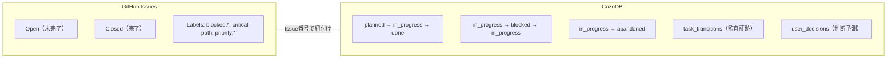
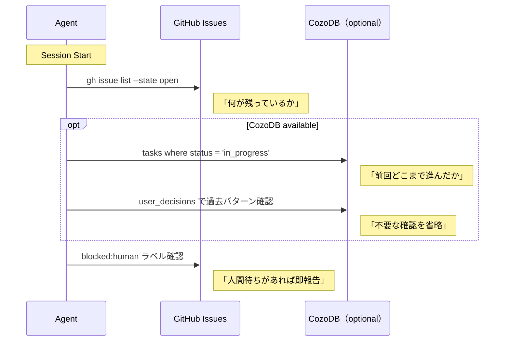

# Task State Boundary: GitHub Issues vs CozoDB

タスク管理を GitHub Issues と CozoDB に分けている理由と、その境界を定義する。

## 原則

**GitHub Issues = タスク定義 + 人間インターフェース**
**CozoDB = 実行ログ + エージェントの記憶**

この2つは**別の関心事**を扱う。同じ状態を二箇所に書かない。

## 境界マッピング



## 各レイヤーの責務

| 観点 | GitHub Issues | CozoDB |
| --- | --- | --- |
| **書くもの** | What（何をやるか）、acceptance criteria | When/Who/How（いつ、誰が、どう遷移したか） |
| **状態モデル** | Open / Closed の **2値** | ステートマシン（5状態 + 遷移ログ） |
| **ラベルの役割** | **分類と通知**（状態管理ではない） | — |
| **クエリする人** | 人間（Web UI）+ エージェント（`gh` CLI） | エージェントのみ（Datalog） |
| **永続性** | GitHub 上（セッション・クラッシュに耐える） | ローカル DB（オプショナル） |
| **CozoDB 無しで動く？** | ✅ 常に動く | — |

## ラベルは「分類」であり「状態」ではない

### 使うラベル

| ラベル | 目的 | 状態管理？ |
| --- | --- | --- |
| `blocked:human` | 人間のアクションが必要（通知トリガー） | ❌ 分類 |
| `blocked:external` | 外部依存（情報提供） | ❌ 分類 |
| `critical-path` | 遅延がプロジェクト全体に影響 | ❌ 分類 |
| `priority:high` | 次に着手すべき | ❌ 分類 |

### 廃止したラベル

| 旧ラベル | 理由 | 代替 |
| --- | --- | --- |
| ~~`status:planned`~~ | Issue が Open = planned | GitHub の Open/Closed で十分 |
| ~~`status:in-progress`~~ | CozoDB と二重管理になる | CozoDB `tasks.status` |
| ~~`status:blocked`~~ | `blocked:*` で代替可能 | `blocked:human` / `blocked:external` |

## なぜ二重管理を避けるか

```
問題: GitHub Label = "status:in-progress"、CozoDB = "blocked"
どちらが正しい？ → 答えがない = データ不整合
```

単一の情報源（Single Source of Truth）にすることで：

- **GitHub Issues**: 「このタスクはまだ終わっていない」（Open）か「終わった」（Closed）かだけを示す
- **CozoDB**: 「今この瞬間どの状態か」を正確に記録する
- **ラベル**: 状態ではなく「このタスクは人間待ち」「このタスクは最優先」という**属性**を示す

## CozoDB がない環境

CozoDB はオプショナル。未導入時のフォールバック：

| 機能 | CozoDB あり | CozoDB なし |
| --- | --- | --- |
| タスク定義 | GitHub Issues | GitHub Issues（変わらない） |
| 状態遷移ログ | `task_transitions` | なし（Issue コメントで代替） |
| 孤立タスク検出 | Datalog クエリ | `gh issue list --state open`（精度は落ちる） |
| 判断予測 | `user_decisions` | なし（毎回確認） |

**最低限の動作は GitHub Issues だけで保証する。** CozoDB は精度と効率を上げる強化レイヤー。

## Session Start での使い分け



## Anti-Patterns

- ❌ GitHub Label で細かい状態管理をする（`status:in-progress` 等）
- ❌ CozoDB と GitHub Label に同じ状態を書く（二重管理）
- ❌ CozoDB 必須の機能を GitHub Issues のフォールバックなしに作る
- ❌ ラベルを状態遷移のトリガーに使う（ラベルは分類、CozoDB が状態）
