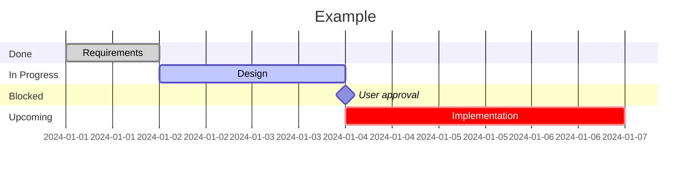

# Enforcing Code Standards

Production-grade code quality rules for all languages and projects.

## Activation

Activate when:

1. Writing new code (any language)
2. Reviewing or refactoring existing code
3. Setting up project tooling (linters, formatters, CI)
4. Providing code in documentation or examples

## Methods and Procedures

### Reliable Methods First

Propose the most reliable and reproducible method first, considering target OS, default shell, and tool compatibility.

### Executable Scripts

Provide multi-line commands as executable script files, not copy-paste blocks. Each line must include a trailing comment. State permanent changes the script makes (files, env vars, services, packages).

### Persist Context

Use available memory/persistence tools to store user context. Prevent repetitive re-explanation.

### Session Log

At session end, write to `MEMORY/YYMMDD.md`:

- **Action**: What was done
- **Impact**: Results (positive or negative)
- **Cause Analysis**: Why correct or what caused failure
- **Prevention**: Recurrence prevention measures

## Code Quality Checklist

Apply these rules to all code:

### Production-Grade

Design metrics, security, and observability from the start:

- Input validation and sanitisation
- Error handling that never leaks internals
- Performance-measurable instrumentation points
- Principle of least privilege

### Separation of Concerns

- **Pure vs impure**: Separate deterministic functions from I/O/state mutation
- **Domain vs generic**: Separate business logic from data transformation utilities

### External Dependency Wrapping

Never call external services, APIs, or CLI tools directly from feature code:

- **Wrap** — create an adapter with a clean interface that hides the external API
- **Test** — unit test the wrapper with mocked external calls
- **Depend on the interface** — feature code imports the wrapper, never the raw SDK/client

This enables: swapping implementations, testing in isolation, and containing blast radius when external APIs change.

### Documentation Comments

All exported items must include standard doc comments (JSDoc, docstrings, etc.):

- Purpose, parameters with types, return value, thrown errors
- Usage examples where non-obvious

### Diagrams in Docs

Choose format by audience and diagram type:

| Audience | Diagram type | Format |
| --- | --- | --- |
| Human (README, design docs, ADRs) | All | **Mermaid** |
| Agent (SKILL.md) | Dependencies / graphs | Graph DB query (Datalog) |
| Agent (SKILL.md) | Steps / flows | Numbered list |
| Agent (SKILL.md) | Comparisons | Table |
| Agent (SKILL.md) | Hierarchies | Indented list |

### Task Planning Visualization

All non-trivial tasks must include a **mermaid Gantt chart** in the task tracking file showing:

- **Planned** tasks, **active** tasks (`active`), and **critical path** (`crit`)
- **Human gates** — mark with `milestone` to flag where human approval blocks progress

**Rules:**

- Write the Gantt chart to a **persistent file** (e.g., `task.md`) — survives session interruption
- On session start, **check for existing task files** — if found, resume from last known state
- `milestone` gates must name **who** is blocking and **what** they need to decide
- Update the chart **after each phase completion**, not just at the start

### Structured Logging

See [references/logging-standards.md](references/logging-standards.md) for the full specification.

Quick rules:

- Levels: `FATAL` / `ERROR` / `WARN` / `INFO` / `DEBUG`
- Required fields: ISO 8601 timestamp, level, module, message
- Never log secrets, PII, or raw sensitive data
- Every `ERROR` must answer: what failed, why, what input caused it

### TypeScript Type Safety

- Never use `any` — use `unknown` with explicit narrowing
- Minimise `as Type` assertions
- Prefer interfaces over classes for data structures

### Functional & Immutable-First

- Prefer `.map()`, `.filter()`, `.reduce()` over `for` loops
- Never mutate arguments or shared state
- Prefer plain objects with interfaces over classes
- Use `export`/non-export for public/private boundaries

### High-Value Comments Only

Comment only _why_, not _what_. No conversational comments. No TODO without issue reference.

### Conventional Commits

Format: `type(scope): description`

- `feat`, `fix`, `refactor`, `docs`, `chore`, `test`, `ci`
- Workspace conventions override this default

### Technology Decision Records

Document tool/library/framework choices in `docs/decisions/` using ADR format:

- Topic, alternatives with pros/cons, chosen option, rationale, trade-offs
